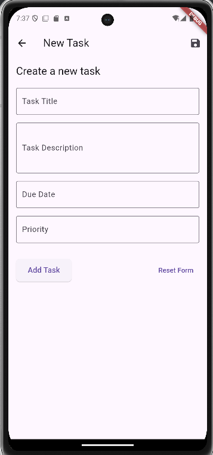

## **Task: Build a Task Management App**

You are required to create a **Task Management App** with the following functionalities:

---

## **Features**

### **1. Task Management**

- Users should be able to:
    - Add, edit, delete, and view tasks.
    - Mark tasks as "Completed" or "Pending."

### **2. Data Storage**

- **SQLite**:
    - Use SQLite to store **task details**.
    - Persist task data across app launches.
- **Hive**:
    - Use Hive to store **user preferences**, such as:
        - App theme (light/dark).
        - Default sort order for tasks (by date, priority, etc.).

### **3. State Management**

- Use **Riverpod** to manage the app's state, including:
    - Task management (CRUD operations).
    - User preferences.

### **4. MVVM Architecture**

- Follow the **MVVM architecture**:
    - **Model**: Data models for tasks and user preferences.
    - **ViewModel**: Handle business logic and state.
    - **View**: Build a clean UI with separation of concerns.

### **5. Responsive Design**

- Create a responsive layout that adapts to:
    - **Mobile devices**: Compact view with a list of tasks.
    - **Tablet devices**: Split view showing the task list and details side-by-side.

### **6. Additional Features (Optional)**

- Add search and filter functionality for tasks.
- Implement local notifications for task reminders.

---

## **Technical Requirements**

1. **Language & Framework**:
    - Use **Dart** and **Flutter**.
2. **Libraries**:
    - **Riverpod**: For state management.
    - **SQLite** and **Hive**: For local data storage.
3. **UI**:
    - Ensure the app supports both **light** and **dark modes**.

---

---

## ** Output **

---

## **Evaluation Criteria**

- **Architecture**: Proper implementation of MVVM architecture.
- **State Management**: Effective use of Riverpod.
- **Data Persistence**: Efficient use of SQLite and Hive for data storage.
- **Code Quality**: Readability, reusability, and adherence to best practices.
- **Responsive Design**: UI that works seamlessly across different screen sizes.
- **Bonus**: Extra features like notifications or animations.
